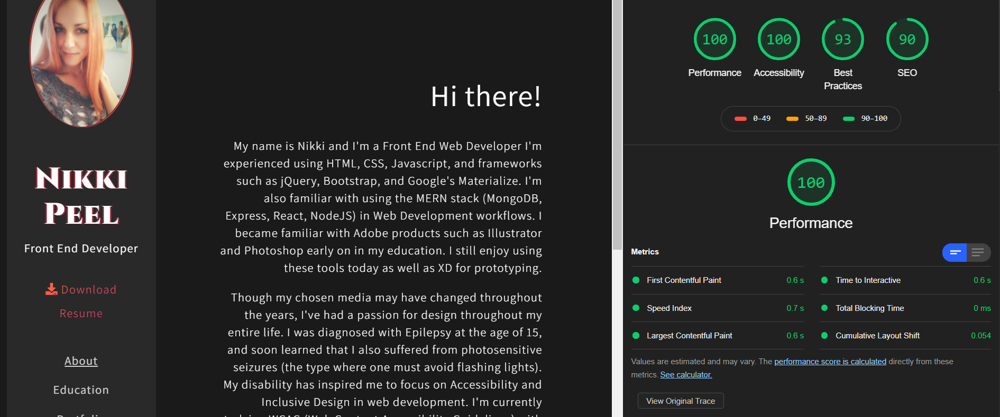

<h1>bootstrap-portfolio</h1>

*My current portfolio website built with Bootstrap 4*
  

[Visit Site](http://www.nikkipeel.com)
 

:gem: **Features:**
- Mobile-responsive
- Dark theme, gradient accents
- Sidebar navigation
- Card slider displaying recent projects
- Passes Axe beta and Lighthouse tests

### Homepage with Side Navigation &darr;

 

### Responsive Menu &darr;

 

### Education Section &darr;

 

### Recent Projects &darr;

 

### Contact Form &darr;

 

### Axe beta Results &darr;

 

### Lighthouse Results &darr;
